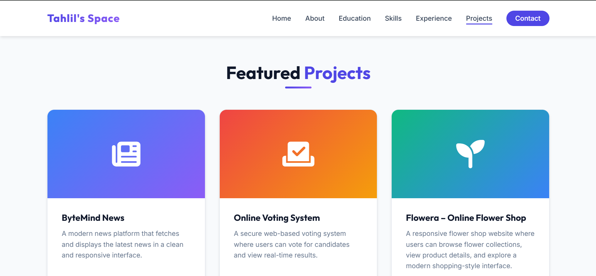
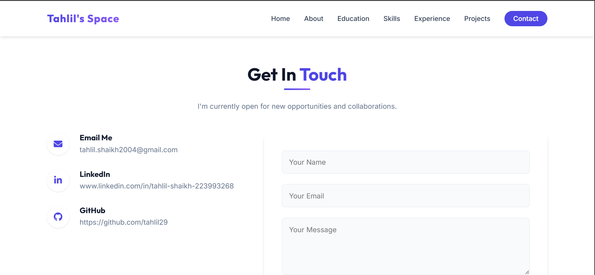

Personal Portfolio Website 💻

This is my personal developer portfolio website where I showcase my projects, skills, education, and experience as a Python Developer and Graphic Designer.
The website is designed to provide a clean and professional overview of my work and allow visitors to explore my projects and contact me easily.

🌐 Live Website
Visit the portfolio here:
https://portfolio-x8op.onrender.com/

📌 Project Overview
The portfolio website highlights my journey as a Computer Science student and developer. It includes sections that display my background, technical skills, projects, and contact information.
The main goal of this project is to create a professional online presence that represents my work and achievements.

🚀 Features
Modern and responsive design
Smooth scrolling navigation
Dedicated sections for projects and skills
Professional portfolio layout
Mobile-friendly interface
Contact form for collaboration and opportunities

📂 Website Sections
The portfolio contains the following sections:
Home
Introduction with name, role, and quick navigation to important sections.
)
About Me
Information about my background, interests, and goals as a developer.
Education
Details about my B.Tech in Computer Science Engineering at Geetanjali Institute of Technical Studies.
Skills
Technical and creative skills including:
Python
Java
C++
Database Basics
Graphic Design
Branding
UI Design
!Skill Page](Screenshot 2026-03-10 133536.png)

Experience
Workshops and volunteer experiences related to technology and development.

Projects
Some of my major projects include:
ByteMind News – Online news platform built with Python and Flask
Online Voting System – Digital voting platform with database integration
Flowera – Frontend flower shop website

Contact
Visitors can reach out through the contact form or connect via GitHub and LinkedIn.

🛠️ Technologies Used
Frontend:
HTML
CSS
JavaScript
Design:
Responsive UI design
Modern portfolio layout
Deployment:
Render hosting

📈 Future Improvements
Planned improvements for the portfolio include:
Adding more project case studies
Integrating GitHub API for automatic project display
Adding dark mode
Improving animations and UI design
Adding blog section

👨‍💻 Author
Tahlil Ullah Shaikh
B.Tech Computer Science Engineering
Python Developer | Graphic Designer

GitHub: https://github.com/tahlil29
⭐ If you like this project, consider giving it a star on GitHub!
